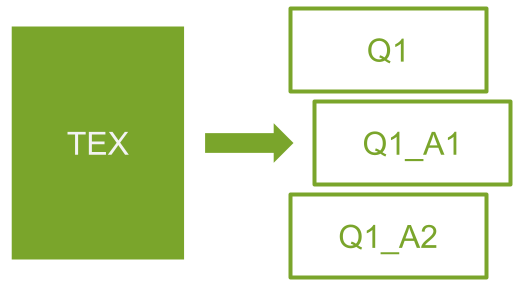

<!-- README template: https://github.com/othneildrew/Best-README-Template -->

<!-- PROJECT SHIELDS -->
<!--
*** I'm using markdown "reference style" links for readability.
*** Reference links are enclosed in brackets [ ] instead of parentheses ( ).
*** See the bottom of this document for the declaration of the reference variables
*** for contributors-url, forks-url, etc. This is an optional, concise syntax you may use.
*** https://www.markdownguide.org/basic-syntax/#reference-style-links
-->
[![Contributors][contributors-shield]][contributors-url]
[![Forks][forks-shield]][forks-url]
[![Stargazers][stars-shield]][stars-url]
[![Issues][issues-shield]][issues-url]

<!-- PROJECT LOGO -->
<br />
<p align="center">
  <a href="https://github.com/daniprec">
    
  </a>

  <h3 align="center">LATEX TO IMAGES</h3>
</p>

This repository reads LaTeX multiple-choice questions and generates an image for each equation and each choice.

## Running the Script

You can run the script in the command line through Python:

```python
python tex2imgs.py -file <path-to-your-tex-file>
```

All the images will be generated in the folder "output". You can define a new output folder using the `-output` parameter.

```python
python tex2imgs.py -file <path-to-your-tex-file> -output <path-to-output-folder>
```

<!-- MARKDOWN LINKS & IMAGES -->
<!-- https://www.markdownguide.org/basic-syntax/#reference-style-links -->
[contributors-shield]: https://img.shields.io/github/contributors/daniprec/LaTeX2img.svg?style=for-the-badge
[contributors-url]: https://github.com/daniprec/LaTeX2img/graphs/contributors
[forks-shield]: https://img.shields.io/github/forks/daniprec/LaTeX2img.svg?style=for-the-badge
[forks-url]: https://github.com/daniprec/LaTeX2img/network/members
[stars-shield]: https://img.shields.io/github/stars/daniprec/LaTeX2img.svg?style=for-the-badge
[stars-url]: https://github.com/daniprec/LaTeX2img/stargazers
[issues-shield]: https://img.shields.io/github/issues/daniprec/LaTeX2img.svg?style=for-the-badge
[issues-url]: https://github.com/daniprec/LaTeX2img/issues